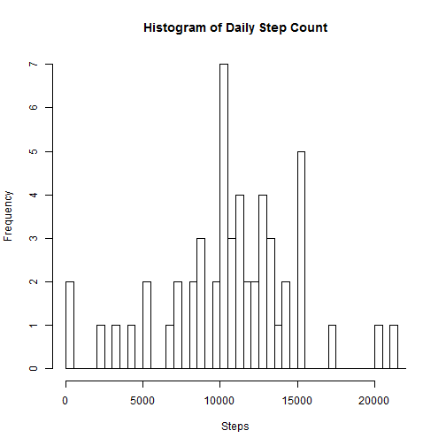
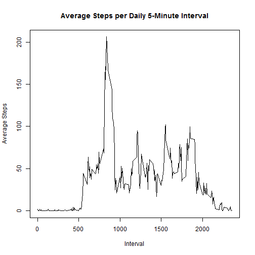
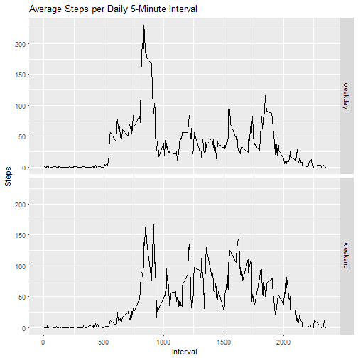

```r
knitr::opts_chunk$set(echo = TRUE)
library(ggplot2)
```

# Loading and preprocessing the data


```r
activity = read.csv(file = "activity.csv",na.strings = "NA", header = T)
activity$date = as.Date(activity$date)
activity$steps = as.integer(activity$steps)
```


# What is mean total number of steps taken per day?

```r
steps_per_day = aggregate(activity$steps, by = list(activity$date), FUN = sum)
hist(steps_per_day$x, breaks = seq(0,22000,500),main = "Histogram of Daily Step Count",xlab = "Steps")
```



```r
mean_steps = as.character(round(mean(steps_per_day$x, na.rm = T),2))
median_steps = median(steps_per_day$x, na.rm = T)
```

The mean number of steps per day is 10766.19, while the median number of steps per day is 10765.

# What is the average daily activity pattern?


```r
mean_steps_per_interval = aggregate(activity$steps, by = list(activity$interval), FUN = mean, na.rm = T)
names(mean_steps_per_interval) = c("interval","mean_steps")
plot(x = mean_steps_per_interval$interval, y = mean_steps_per_interval$mean_steps,type = "l", xlab = "Interval", ylab = "Average Steps", main = "Average Steps per Daily 5-Minute Interval") 
```



```r
max_interval = mean_steps_per_interval$interval[which.max(mean_steps_per_interval$mean_steps)]
```
The interval with the highest average number of steps is from 835 to 840.

# Imputing missing values


```r
count_na = sum(!complete.cases(activity))
activity_imputed = merge(activity, mean_steps_per_interval,by = "interval",all.x = T)
activity_imputed[which(is.na(activity_imputed$steps)),"steps"] = activity_imputed[which(is.na(activity_imputed$steps)),"mean_steps"]

steps_per_day2 = aggregate(activity_imputed$steps, by = list(activity_imputed$date), FUN = sum)
hist(steps_per_day2$x, breaks = seq(0,22000,500),main = "Histogram of Daily Step Count",xlab = "Steps")
```


```r
mean_steps2 = as.character(round(mean(steps_per_day2$x),2))
median_steps2 = as.character(round(median(steps_per_day2$x, na.rm = T),2))
```
There are 2304 rows with NA values in the data.
After imputing the data, the mean steps taken per day is 10766.19 and the median is 10766.19.  This is the same as our previous mean, but differs from the previous median of 10765. Since we imputed based on means from specific intervals in the raw data, it makes sense that the mean doesn't change and the median changes slightly.

# Are there differences in activity patterns between weekdays and weekends?


```r
activity_imputed$week_part = NA
activity_imputed[which(weekdays(activity_imputed$date) %in% c("Saturday","Sunday")),"week_part"] = "weekend"
activity_imputed[is.na(activity_imputed$week_part),"week_part"] = "weekday"
activity_imputed$week_part = as.factor(activity_imputed$week_part)

mean_steps_per_interval2 = aggregate(activity_imputed$steps, by = list(activity_imputed$interval,activity_imputed$week_part), FUN = mean)
ggplot(mean_steps_per_interval2,aes(x = Group.1, y = x)) + geom_line() + facet_grid(Group.2 ~.) + labs(title = "Average Steps per Daily 5-Minute Interval", y = "Steps", x = "Interval")
```



